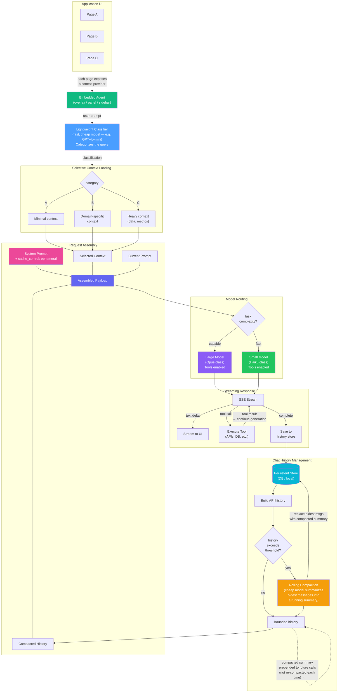

# Embedded AI Agent Architecture

Generic pattern for embedding an agentic AI workflow directly into application UI.

Paste into [mermaid.live](https://mermaid.live) to render.

## Token Efficiency Strategies

| Strategy | How | Savings |
|---|---|---|
| **Classification** | Cheap model categorizes query so only relevant context is loaded | Avoids sending full app state on every request |
| **Rolling Compaction** | Cheap model summarizes oldest messages into a running summary when history exceeds a threshold — summary is prepended to future calls, not recomputed each time | Bounds history growth — O(1) instead of O(n) |
| **Prompt Caching** | `cache_control: ephemeral` on system prompt | Cache hit skips re-processing system prompt tokens (often thousands) |
| **Model Routing** | Route to smaller model for simpler tasks | Direct cost reduction per request |

## Key Design Decisions

1. **Classifier is separate from the main LLM** — uses a fast, cheap model so classification cost is negligible
2. **Context is pulled, not pushed** — pages expose a provider; the agent only calls it after classification tells it what's needed
3. **Compaction is rolling, not per-request** — maintains a bounded summary over time rather than compressing on every call
4. **Prompt cache lives on the system prompt** — the part that rarely changes gets cached; context and history (which change) don't
5. **Tool loop is recursive** — tool results feed back into the stream, enabling multi-step agentic workflows
